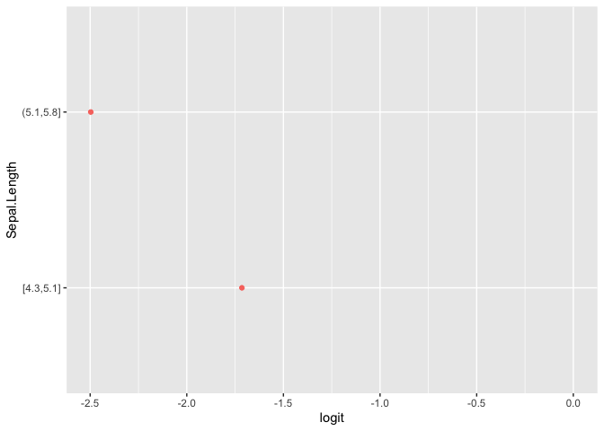
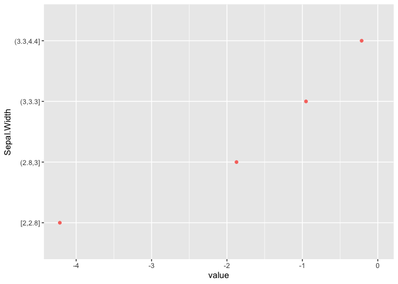
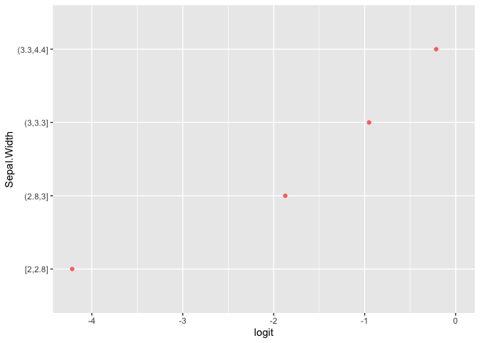

<!-- README.md is generated from README.Rmd. Please edit that file -->

# pomcheckr

<!-- badges: start -->

<!-- badges: end -->

The goal of pomcheckr is to mplements the method described in  for
checking if the proportional odds assumption holds for a cumulative
logit model.

## Installation

<!--You can install the released version of pomcheckr from [CRAN](https://CRAN.R-project.org) with:

``` r
install.packages("pomcheckr")
```
-->

You can install the development version from
[GitHub](https://github.com/) with:

``` r
# install.packages("devtools")
devtools::install_github("melissa-wong/pomcheckr")
```

## Example

This is an example using formula syntax:

``` r
library(pomcheckr)
plot(pomcheck(Species ~ Sepal.Length + Sepal.Width, iris))
```



The following syntax is equivalent:

``` r
plot(pomcheck("Species", c("Sepal.Length", "Sepal.Width"),
              iris))
```



And if you want to examine the `pomcheck` object underlying the plots:

``` r
p <- pomcheck(Species ~ Sepal.Length + Sepal.Width, iris)
summary(p)
#>      Length Class      Mode
#> [1,] 4      grouped_df list
#> [2,] 4      grouped_df list
p
#> [[1]]
#> # A tibble: 4 x 4
#> # Groups:   Sepal.Length [4]
#>   Sepal.Length `Species_>=1` `Species_>=2` `Species_>=3`
#>   <fct>                <dbl>         <dbl>         <dbl>
#> 1 [4.3,5.1]              Inf        -1.97        -3.69  
#> 2 (5.1,5.8]              Inf         0.580       -1.92  
#> 3 (5.8,6.4]               NA       Inf            0.0572
#> 4 (6.4,7.9]               NA       Inf            1.06  
#> 
#> [[2]]
#> # A tibble: 4 x 4
#> # Groups:   Sepal.Width [4]
#>   Sepal.Width `Species_>=1` `Species_>=2` `Species_>=3`
#>   <fct>               <dbl>         <dbl>         <dbl>
#> 1 [2,2.8]               Inf         3.83         -0.388
#> 2 (2.8,3]               Inf         1.42         -0.452
#> 3 (3,3.3]               Inf         0.547        -0.405
#> 4 (3.3,4.4]             Inf        -1.64         -1.86 
#> 
#> attr(,"class")
#> [1] "pomcheck" "list"
```
